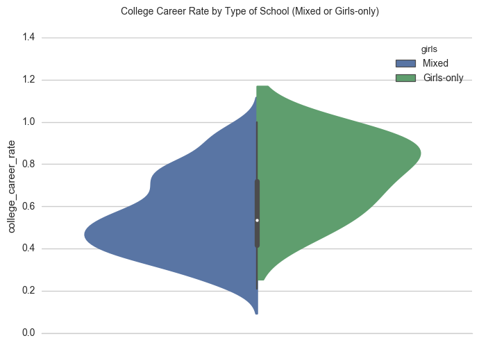
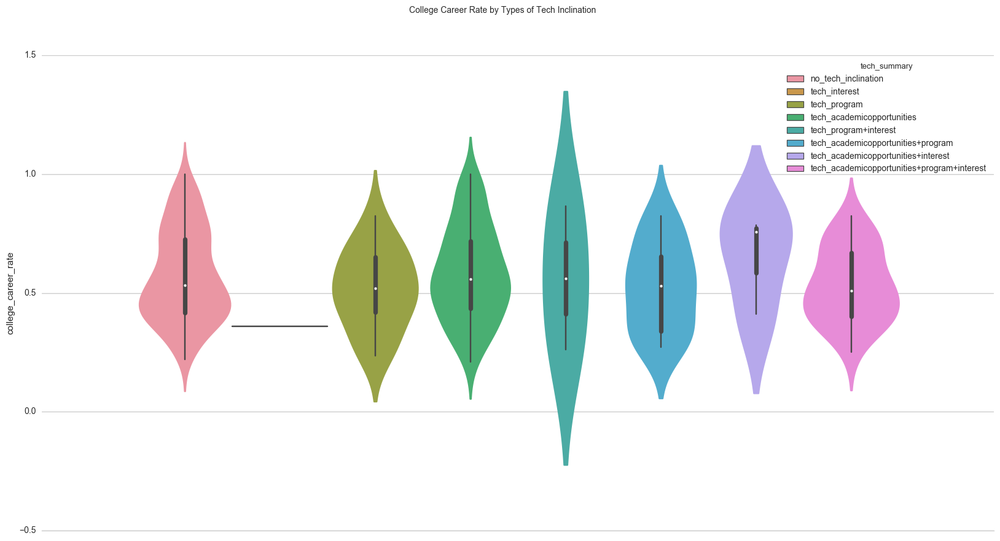
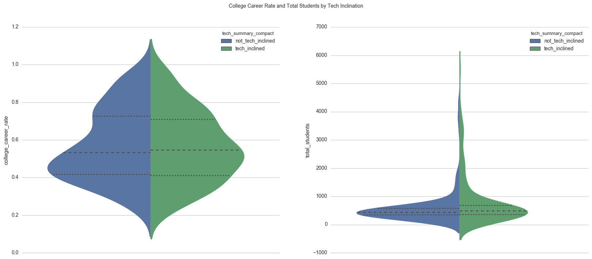
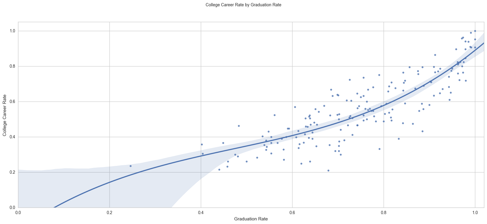
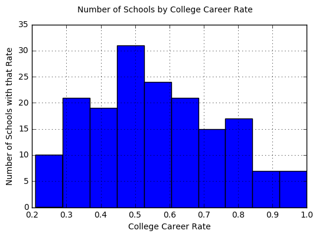
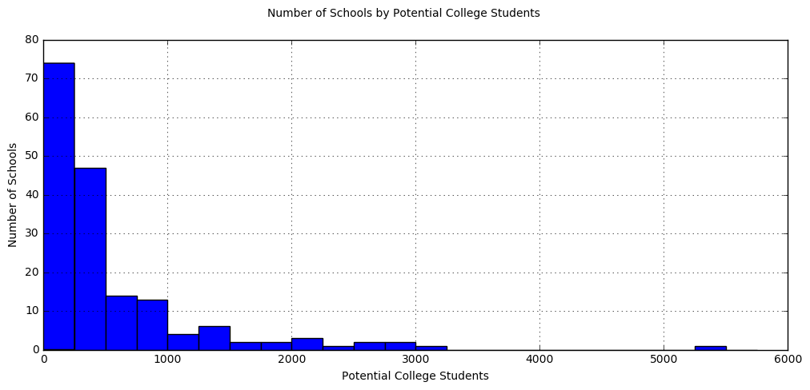
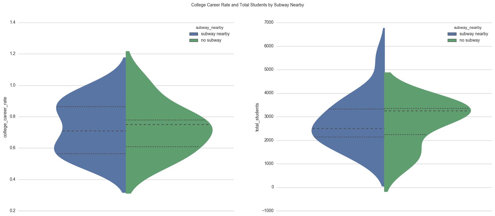
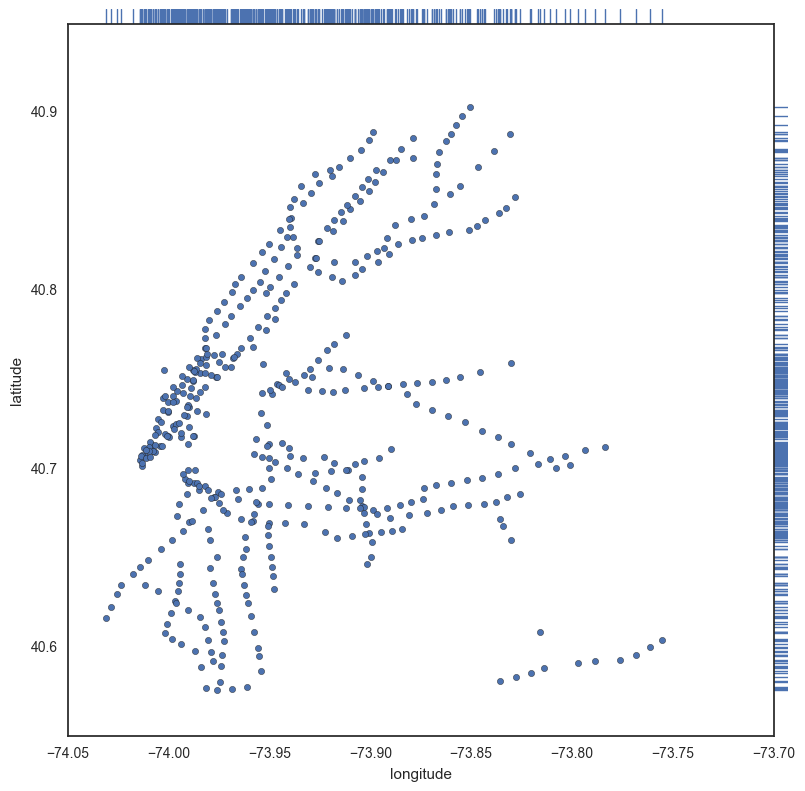
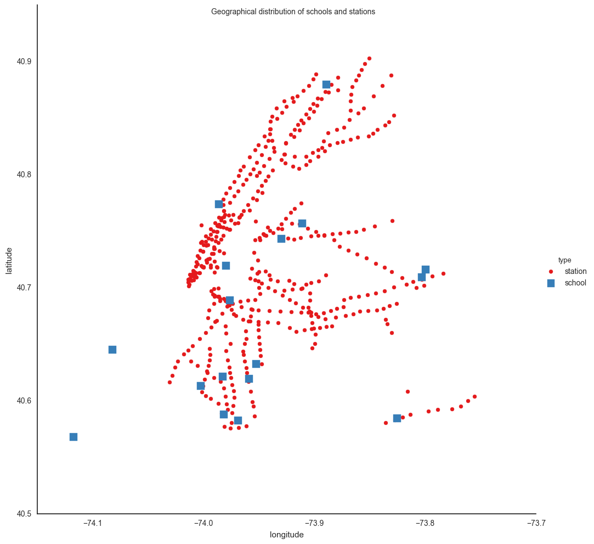
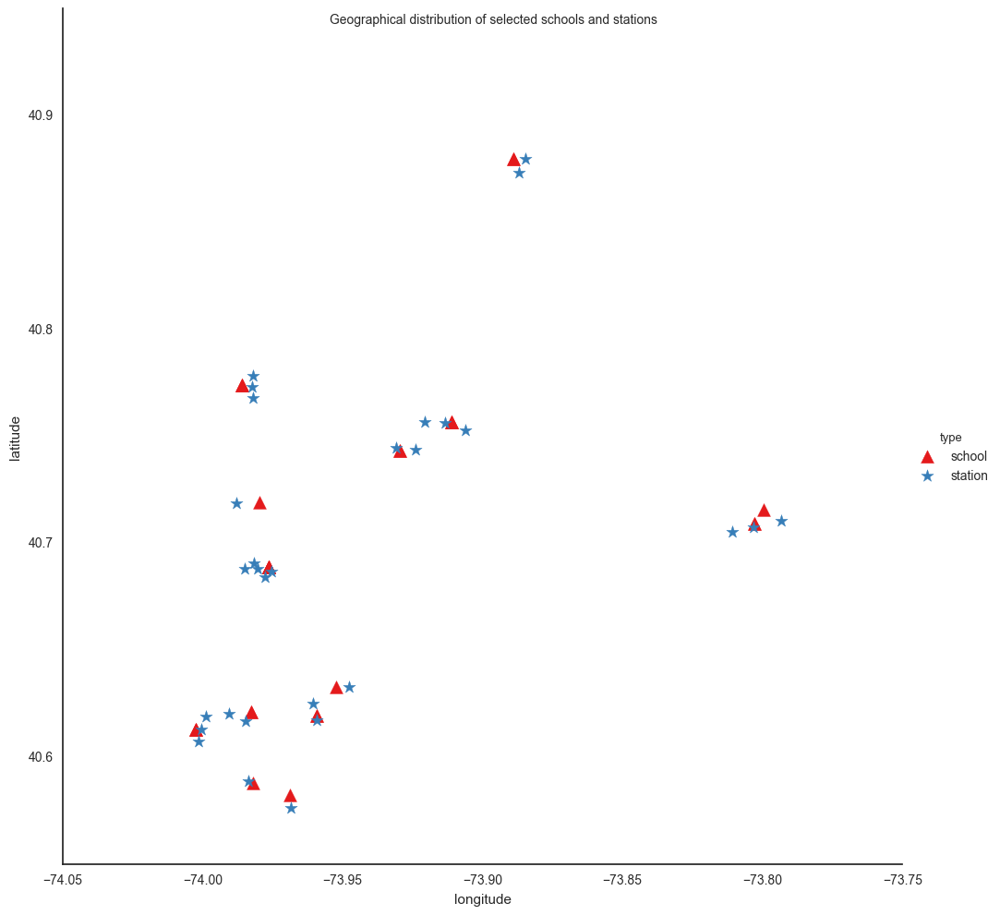

# nyc-subway-canvass
Recommender for best NYC subway stations to canvass to raise awareness about women in tech.

## Introduction
This is an open-ended project for the Data Science program at [K2 Data Science](http://k2datascience.com). An assignment was previously done regarding the turnstile dataset available on the MTA website. That assignment can be found under the [mta-assignment folder](mta-assignment/) for reference.

A minimum valuable product (MVP) of this research was conducted using the [MTA turnstile dataset](http://web.mta.info/developers/turnstile.html) and its findings can be found on the [MVP page](MVP.md).

## Goals
A non-profit organization is trying to raise awareness about women in technology. We need to identify the best areas to canvass during the day. The organization will be placing street teams at the entrances to various subway stations in New York City.

## Assumptions
We have figured out that to improve the number of women in tech our audience had to be taken into account. Besides studies showing that young people can be more open-minded and receptive to new ideas, high school students are the main group of people who is about to choose a career path in the near future.

We found out that NYC has the biggest subway system in the world by number of stations. The MTA dataset alone has over 300 stations and that means that successfully filtering out at least 90% of stations and making a good recommendation had the potential to either make this canvassing project fail or succeed.

## Approach
We started by researching open data about high schools in NYC and found the [Department of Education's 2017 dataset on high schools](https://data.cityofnewyork.us/Education/DOE-High-School-Directory-2017/s3k6-pzi2). It seemed to have all data we needed, including the number of students per school, whether they are boys- or girls-only or "hybrid", and their location. A more detailed description of the dataset can be found on this [spreadsheet](data/doe_hsdirectory_data_dictionary_2017.xlsx).

The next step was to search for an open dataset that included the location of NYC subway stations so we could match them with the high schools. We then found this other [dataset](https://data.cityofnewyork.us/Transportation/Subway-Stations/arq3-7z49) provided by MTA. All we had to do then was to clean both datasets and further join them with the MTA dataset we used in the MVP to build the recommendation.

Both datasets are hosted on the [NYC Open Data website](https://data.cityofnewyork.us) and so we believe that to be a good source of datasets when it comes to New York City.

## Cleaning and Exploring the Data
Each of the 3 datasets used in this project were cleaned and explored in a separate [Jupyter notebook](http://jupyter.org). The resulting [Pandas](http://pandas.pydata.org) [DataFrames](http://pandas.pydata.org/pandas-docs/stable/dsintro.html#dataframe) were saved as binary pickle files that were then loaded and matched together in the [recommender.ipynb](recommender.ipynb) notebook.

### MTA turnstile dataset
*Please refer to the [mta-cleaning-exploration.ipynb](mta-cleaning-exploration.ipynb) Jupyter notebook.*

As explained on the [MVP page](MVP.md), for each turnstile, it records the number of entries and exits in time intervals, as well as the date and time and in which subway station the turnstile is placed.

To account for seasonality, we have refined the research question to plan for the canvass to be realized in February 2017. We have then decided to use the MTA data from February 2016 and have also filtered out all data related to weekends or NYC holidays. My focus was only on entries data, having ignored exits.

We have also planned to filter out data from 8pm to 8am but found out that each turnstile had data being recorded in different timing. Most of them had data recorded in 4-hour intervals but some of them started at 8am, while others at 7am or at 7:30 am. To make it harder, some of them had seemingly random timestamps. To avoid having misleading data I have decided not to filter data based on the time of the day.

Having all data from February weekdays segmented by station, we then calculated the average daily entries for each station.

### DOE High School Directory dataset
*Please refer to the [high-schools-cleaning-exploration.ipynb](high-schools-cleaning-exploration.ipynb) Jupyter notebook.*

We started by filtering out boys-only schools. Our goal is to improve the number of women in tech and therefore talking to male students wouldn't be of much help.

Out of curiosity, we have also noticed that girls-only schools tend to have higher college career rate than mixed schools:

We then noticed that there were 5 columns on "academic opportunities", 10 columns on "programs", and 10 more columns on "interests", and that in each of these areas some schools had something that was tech-related. We have then done some basic natural language processing (NLP) to find whether we could find the words 'technology', 'computer', 'web', 'programming' or 'coding' in any of those areas and figured out that about 46% of the high schools had either tech-related academic opportunities, programs or interest. We called that "tech-inclination" and filtered out the remaining high-schools that did not have it. Our assumption here was that 200 high schools were enough and that it could help the canvassing team if they were talking to female students from schools that actually had some tech-inclination.

Here is a breakdown of college career rate by types of tech inclination:

We have also made a breakdown of both college career rate and total students by tech inclination, which shows that most high schools with 1500 or more students seem to have some kind of tech inclination:

The next step was to explore the column `college_career_rate`, which is defined as "at the end of the 2014-15 school year, the percent of students who graduated "on time" by earning a diploma four years after they entered 9th grade". We could multiply that by the total number of students in each school and calculate the potential number of college schools each school has.

We noticed that 14% of schools didn't have figures on the graduation rate. We also noticed a strong correlation between `college_career_rate` and `graduation_rate`:

We then plotted the `college_career_rate` distribution to help decide if we should either ignore the column or the schools without that data:

Since some schools had a really low college career rate we decided to use that data and filter schools that didn't have it. We then plotted the distribution of schools by their number of potential college students:

We have noticed that there was a big gap in the number of schools with more than 1000 potential college students as compared to the number of schools with a lower number. Since we wanted to reduce the number of recommended stations by at least 90% and there were 24 schools with at least 1000 potential college students we have decided to filter those and ignore the other ones.

Since the dataset also has data on bus and subway lines we also filtered out schools with bus lines data but without subway lines data. Out of curiosity, we first compared `college_career_rate` and `total_students` and noticed how the 75% percentile of college career rate in high schools with a subway nearby is much higher, as well as the fact that the schools with the highest number of students all seem to have a subway nearby:

That left us with 17 remaining high schools to work with — the ones that were not girls-only, that had some kind of tech inclination, that had more than 1000 potential college students and that were near a subway station.

The final step was to do some basic NLP and extract the latitude and longitude coordinates from the schools `location` column. That was necessary to later calculate the distances between schools and stations.

### MTA Subway Stations dataset
*Please refer to the [stations-location-cleaning.ipynb](stations-location-cleaning) Jupyter notebook.*

After some initial exploration, we noticed this dataset contained an entry for each station entrance. In other words, each station could contain multiple entries in the dataset.

All we had to do was to filter the latitude and longitude from the `location` column and to save a cleaner DataFrame for later use.

We also plotted the stations coordinates to have a feel for their geographical location:

## Finding Target Stations
*Please refer to the [recommender.ipynb](recommender.ipynb) Jupyter notebook.*

Since we started with 3 DataFrames that were already cleaned and explored in other notebooks, our task here was to join those data sources in order to make recommendations.

We started by getting a visual for the joined geographical distributions of both schools and stations. We quickly noticed there were a couple of schools with no nearby stations. That warned us our algorithm would have to take that into account.

Next, we had to face the challenge that the stations names were different in each of the 2 subway datasets. To solve that we did some basic NLP to match those names programmatically where it was easy to do so and "manually" by the use of a Python map otherwise. The result was a stations DataFrame with both the average daily traffic for February and the coordinates for each station entrance.

Next, we set out to find which stations were within walking distance from each school. Since we had their latitude and longitude coordinates, we decided to use the [Haversine formula](https://en.wikipedia.org/wiki/Haversine_formula) and check whether they were within 810 meters from each other (a heuristic for 10-15 minutes walking).

Finally, we have filtered out stations with fewer than 4000 average daily entries and selected a maximum of 5 stations per high school. Here is a glimpse of the distribution of the coordinates of the selected schools and stations.

For the final recommendation we have sorted the dataset first by the potential college students of each school and then by the average number of daily traffic for each station. It has 29 stations and also includes data like start and end time for each school, as well as the city in which the school/station is located.

## Final Recommendation
The final recommendation consists of 29 stations. Here are the top 13:

| School Name | Potential College Students | Start Time | End Time | Station Name | Avg. Daily Traffic Feb. | City |
| --- | --- | --- | --- | --- | --- | --- |
| Brooklyn Technical High School | 5323 | 8:45am | 3:15pm | Atlantic Av - Barclay's Center | 42502 | Brooklyn |
| Brooklyn Technical High School | 5323 | 8:45am | 3:15pm | Fulton St | 20537 | Brooklyn |
| Brooklyn Technical High School | 5323 | 8:45am | 3:15pm | DeKalb Ave | 16672 | Brooklyn |
| Brooklyn Technical High School | 5323 | 8:45am | 3:15pm | Nevins St | 	13952 | Brooklyn |
| Brooklyn Technical High School | 5323 | 8:45am | 3:15pm | Hoyt - Schermerhorn Sts | 12996 | Brooklyn |
| Midwood High School | 3176 | 8:45am | 3:30pm | Brooklyn College - Flatbush Ave | 25688 | Brooklyn |
| Bronx High School of Science | 2976 | 8am | 3:45pm | Mosholu Pkwy | 11744 | Bronx |
| Bronx High School of Science | 2976 | 8am | 3:45pm | Bedford Park Blvd | 7795 | Bronx |
| Edward R. Murrow High School | 2754 | 8:05am | 2:45pm | Ave J | 7226 | Brooklyn |
| Edward R. Murrow High School | 2754 | 8:05am | 2:45pm | Ave M | 6936 | Brooklyn |
| Fiorello H. LaGuardia High School of Music & A... | 2295 | 8am | 4pm | 72nd St | 49478 | Manhattan |
| Fiorello H. LaGuardia High School of Music & A... | 2295 | 8am | 4pm | 6th St - Lincoln Ctr | 31925 | Manhattan |
| Fiorello H. LaGuardia High School of Music & A... | 2295 | 8am | 4pm | 	59th St - Columbus Circle | 21763 | Manhattan |

## Further Analysis

What we would have done further if we had more time:

1. Use an API to calculate the walking duration instead of the Haversine formula. Maybe [Google Maps Distance Matrix API](https://developers.google.com/maps/documentation/distance-matrix).

2. Calculate a station factor that combines distance to the school, number of entries at station, and the school's potential college students.

3. Further refine the research question with a specific number of volunteering teams and volunteers within each team so they don’t stick by the same stations all the time and we reduce their chances of seeing the same people multiple times.

4. Further segment turnstile data by day of week.

5. Plot schools and stations in an interactive map that would let users filter by number of stations to be shown, number of high schools, max number of stations per high school, and max walking duration between school and station. It could also display school and station data when clicking on them.
